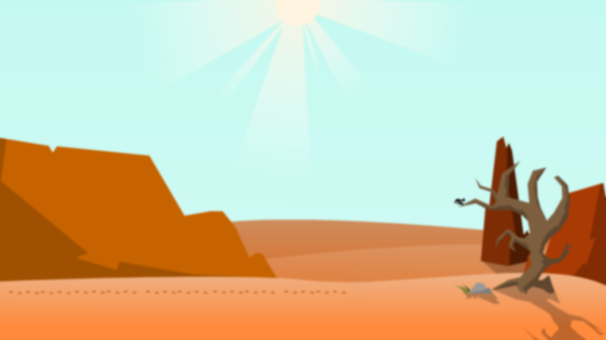
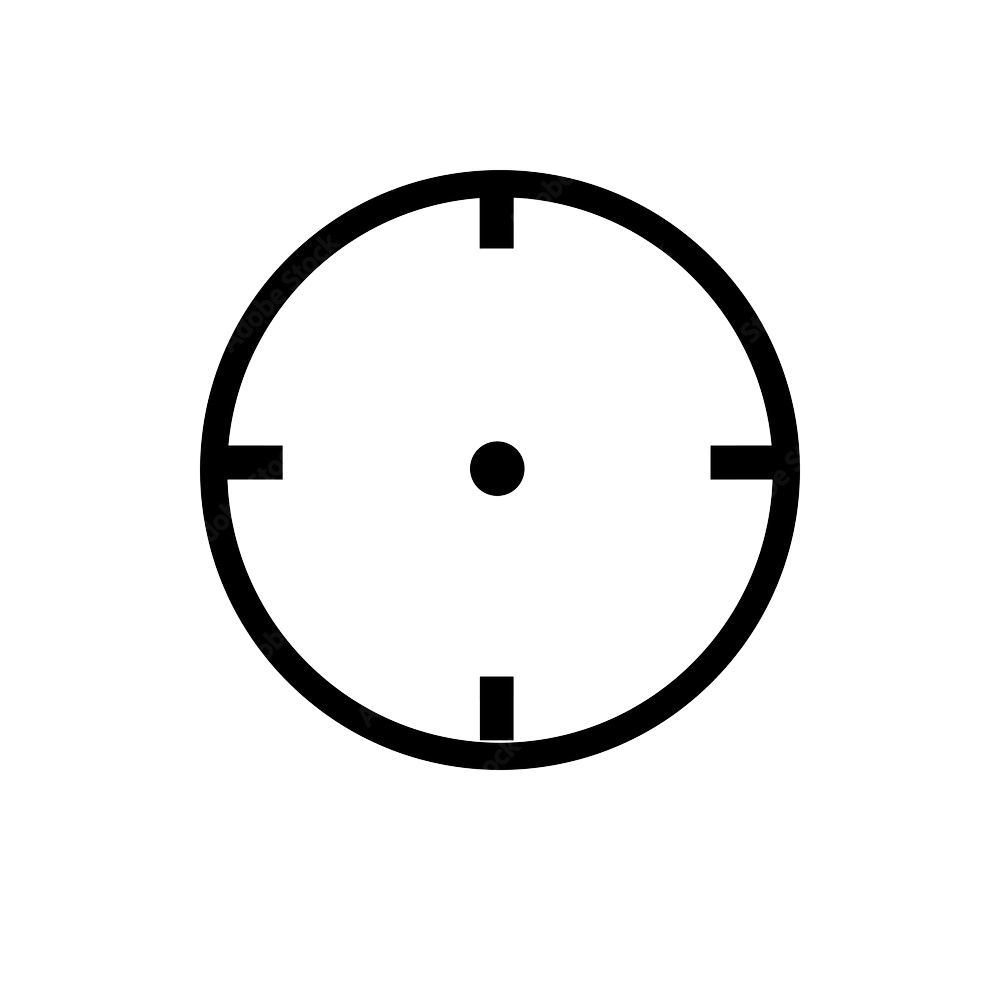

# Tiro ao alvo

Um jogo de tiro ao alvo

## Indice
- <a href="#Funcionalidades">Funcionalidades</a>
- <a href="layout">Layout</a>
- <a href="#rodar">Rodar</a>
- <a href="#tecnologias-Utilizadas">Tecnologias Utilizadas</a>


## Funcionalidades do projeto
- [X] Controle a barra do jogador para acertar a bala no alvo.
- [X] O objetivo é acertar o máximo de alvos.
- [X] Use o mause para acertar o alvo que você deseja atirar.
- [X] atualização de pontos em tempo real.
- [X] O tempo limite é exibido no canto superior da tela
-[X] Quando o tempo acaba, o jogo pausa e a pontuação aparece
- [X] Se quiser reiniciar ou pausar o jogo voçê pressiona a tecla Esc.

## Layout





## Como rodar esse projeto?

```bash

#clone no seu terminal
pip install pygame
#Execute o jogo usando o comando
python main.py


```
## Tecnologias utilizadas 

- python:Para logica e estrutura do jogo
- pygame:Biblioteca usada para desenvolver gráficos e a interação do jogo
- Visual Studio Code:Editor de código utilizado para escrever o código
- Git: Para organização do projeto